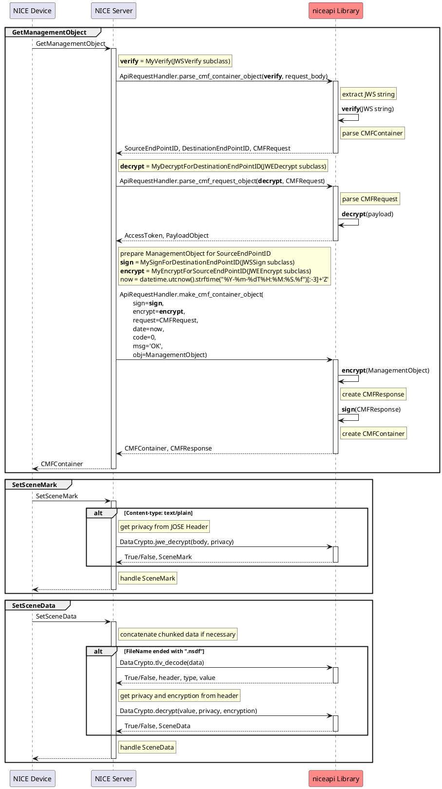

# niceapi library
[NICE 1.1](https://www.nicealliance.org/specs/) compliant library that provides functions:

 * Management, Control, and Data API for NICE Device.

 * CMFContainer/CMFRequest/CMFResponse Object parser and CMFContainer Object builder for NICE Server.
 
 * JOSE handling in Management and Control API.
 
 * Data encryption for Data API.

## Classes

```plantuml
salt
scale 1.2
{#
    ==Class | ==Members | *
    {
        ==ApiRequest
        <color:Gray>   Device API
    } | { 
        security
        endpoint
        management
        control
        ..
        set_security_object()
        set_private_key()
        initialize_jose()
        activate_storage()
        get_management_end_point()
        get_management_object()
        get_control_object()
        get_scene_mode()
        get_privacy_object()
        get_date_time_from_la()
        get_date_time_from_as()
        new_scene_mark()
        set_scene_mark()
        new_scene_data()
        set_scene_data_image()
        set_scene_data_video()
        set_webapi()
        set_max_connection()
        set_permanent_path()
    } | {
        Instance of DeviceSecurity Object
        Instance of ManagementEndPoint Object
        Instance of Management Object
        Instance of DeviceControl Object
        ..
        Set DeviceSecurity Object
        Set DevicePrivateKey
        Set key and certificate for JOSE
        Enable SceneMark and SceneData cache
        Send GetManagementEndPoint
        Send GetManagementObject
        Send GetControlObject
        Send GetSceneMode
        Send GetPrivacyObject
        Send GetDateTime to NICE LA
        Send GetDateTime to NICE AS
        Generate new SceneMark
        Send SetSceneMark
        Generate new SceneData
        Send SetSceneData(Image)
        Send SetSceneData(Video)
        Set WebAPI instance
        Set maximum number of concurrent HTTP connections
        Set path of permanent directory
    }

    {
        ==ApiRequestHandler
        <color:Gray>   Server API
    } | {
        parse_cmf_container_object()
        parse_cmf_request_object()
        make_cmf_container_object()
    } | {
        Parse CMFContainer Object
        Parse CMFRequest Object
        Make CMFContainer Object
    }

    {
        ==DataCrypto
        <color:Gray>   Data encryption API

    } | {
        encrypt()
        decrypt()
        tlv_encode()
        tlv_decode()
        jwe_encrypt()
        jwe_decrypt()
    } | {
        Return AES encrypted bytes (alg: A256GCM)
        Return AES decrypted bytes (alg: A256GCM)
        Return TLV encoded bytes
        Return TLV decoded header, type, value
        Return JWE encrypted str (alg:A 256KW, enc: A256GCM)
        Return JWE decrypted str (alg:A 256KW, enc: A256GCM)
    }

    {
        ==JWSVerify
        <color:Gray>   abstract class
        ..
        ==JWSSign
        <color:Gray>   abstract class
        ..
        ==JWEDecrypt
        <color:Gray>   abstract class
        ..
        ==JWEEncrypt
        <color:Gray>   abstract class
    } | {
        verify()
        <color:Gray>   abstract method
        ..
        sign()
        <color:Gray>   abstract method
        ..
        decrypt()
        <color:Gray>   abstract method
        ..
        encrypt()
        <color:Gray>   abstract method
    } | {
        Inherit this class and set it to the 1st argument 
        of parse_cmf_container_object().
        ..
        Inherit this class and set it to the 1st argument 
        of make_cmf_container_object().
        ..
        Inherit this class and set it to the 1st argument 
        of parse_cmf_request_object().
        ..
        Inherit this class and set it to the 2nd argument 
        of make_cmf_container_object().
    }

    {
        ==JoseOps
        <color:Gray>   sample implement
    } | {
        verify()
        sign_ops()
        decrypt_ops()
        encrypt_ops()
        register_local_key_cert()
        register_remote_cert()
    } | {
        Provide instance of JWSVerify subclass
        Provide instance dictionary of JWSSign subclass
        Provide instance dictionary of JWEDecrypt subclass
        Provide instance dictionary of JWEEncrypt subclass
        Register key/certificate for signing/decryption
        Register certificate for encryption
    }

    {
        ==WebAPIBase
        <color:Gray>   abstract class
    } | {
        post()
        <color:Gray>   abstract method
        ..
        update_root_cert()
        <color:Gray>   abstract method
    } | {
        Send an HTTPS/POST and handle the response
        .
        ..
        Set TLS root certificates
    }

}
```
* **JoseOps**  
  JoseOps is the sample implementation using [AuthLib](https://docs.authlib.org/) so that NICE Server can handle JOSE in ApiRequestHandler. It can be implemented using another crypto library instead of this class as well.

* **WebAPIBase**  
  WebAPIBase is the class implemented using [Requests](https://requests.readthedocs.io/en/latest/) for the NICE Device handles HTTPS/POST.
  The following steps can replace the HTTP library:
  1. Implement the derived class from WebAPIBase using another HTTP library.
  2. Set the class to APiRequest by set_webapi().

## Files
```plantuml
salt
scale 1.2
{
    {T
    + niceapi         | __Top-level package__
    ++ ~__init__.py   | Initialize niceapi package
    ++ api            | __Subpackage for api__
    +++ ~__init__.py  | Initialize api subpackage
    +++ _api.py       | CommandType, URL, ... etc.
    +++ _mode.py      | _SceneMode class
    +++ common.py     | WebAPIScheme class
    +++ control.py    | ControlObject class
    +++ crypto.py     | DataCrypto class
    +++ data.py       | SceneData class
    +++ endpoint.py   | ManagementEndPoint class
    +++ handlers.py   | ApiRequestHandler class
    +++ management.py | ManagementObject class
    +++ mark.py       | SceneMark class
    +++ requests.py   | ApiRequest class
    +++ security.py   | DeviceSecurityObject class
    ++ cmf            | __Subpackage for cmf__
    +++ ~__init__.py  | Initialize cmf subpackage
    +++ _request.py   | _CMFRequest class
    +++ _response.py  | _CMFResponse class
    ++ crypto         | __Subpackage for crypto__
    +++ ~__init__.py  | Initialize crypto subpackage
    +++ _utility.py   | utility for certificate and random
    +++ base.py       | abstract classes
    +++ jose.py       | concrete Subclasses
    ++ io             | __Subpackage for io__
    +++ ~__init__.py  | Initialize io subpackage
    +++ _webapi.py    | _WebAPI class
    +++ _webapi_default.py | _WebAPIDefault class
    +++ webapi_base.py     | WebAPIBase class
    ++ util           | __Subpackage for util__
    +++ ~__init__.py  | Initialize util subpackage
    +++ _storage.py   | _Storage class
    +++ _tools.py     | other functions
    }
}
```

## Sequence diagram of NICE Device

```plantuml
@startuml
participant "NICE Device App" as App
participant "niceapi Library" as CMF #FF8888
participant "NICE Server" as Cloud
== Initialization ==
App -> CMF : ApiRequest.set_security_object(DeviceSecurityObject)
    note right: set DeviceSecurityObject
App -> CMF : ApiRequest.set_private_key(DevicePrivateKey)
    note right: set DevicePrivateKey
App -> CMF : ApiRequest.initialize_jose()
    note right: set key and certificate for JOSE
== Management and Control API ==
App -> CMF ++ : ApiRequest.get_management_end_point()
CMF -> Cloud ++ : GetManagementEndPoint
CMF <-- Cloud -- : ManagementEndPoint
App <-- CMF -- : True/False

App -> CMF ++ : ApiRequest.get_date_time_from_la()
CMF -> Cloud ++ : GetDateTime
CMF <-- Cloud -- : TrustedTimeResponse
App <-- CMF -- : True/False, datetime
App -> App : Sync with NICE LA

App -> CMF ++ : ApiRequest.get_management_object()
CMF -> Cloud ++ : GetManagementObject
CMF <-- Cloud -- : ManagementObject
App <-- CMF -- : True/False

App -> CMF ++ : ApiRequest.get_date_time_from_as()
CMF -> Cloud ++ : GetDateTime
CMF <-- Cloud -- : TrustedTimeResponse
App <-- CMF -- : True/False, datetime
App -> App : Sync with NICE AS

App -> CMF ++ : ApiRequest.get_control_object()
CMF -> Cloud ++ : GetControlObject
CMF <-- Cloud -- : ControlObject
App <-- CMF -- : True/False

App -> CMF ++ : ApiRequest.get_scene_mode(NodeID)
CMF -> Cloud ++ : GetSceneMode
CMF <-- Cloud -- : SceneMode
App <-- CMF -- : True/False, **SceneMode**
rnote right App: NICE Device App should keep **SceneMode** and use it for subsequent APIs

App -> CMF ++ : ApiRequest.get_privacy_object(**SceneMode**)
CMF -> Cloud ++ : GetPrivacyObject
CMF <-- Cloud -- : PrivacyObject
App <-- CMF -- : True/False, **privacy** (a dictionary of privacy objects)

== Data API (SceneMark) ==
App -> CMF ++ : ApiRequest.new_scene_mark(...)
App <-- CMF -- : scene_mark (instance of SceneMark)
rnote right App : set attributes of SceneMark

App -> CMF ++ : ApiRequest.set_scene_mark(**SceneMode**, scene_mark.json, **privacy**)
loop SceneMarkOutputList
    CMF -> Cloud ++ : SetSceneMark
    CMF <-- Cloud -- : Response [200]
end
App <-- CMF -- : True/False, _

== Data API (SceneData) ==
group Image
alt EncryptionOn == True
App -> CMF ++ : DataCrypto.encrypt(image, privacy, SceneDataEncryption)
App <-- CMF -- : True/False, encrypted_image
App -> CMF ++ : DataCrypto.tlv_encode(encryption, image_type, encrypted_image)
App <-- CMF -- : True/False, TLV encoded image
end
App -> CMF ++ : ApiRequest.new_scene_data(...)
App <-- CMF -- : scene_data(instance of SceneData)
rnote right App : set attributes of SceneData
App -> CMF ++ : ApiRequest.set_scene_data_image(**SceneMode**, scene_data.json)
loop DestinationEndPointList
     CMF -> Cloud ++ : SetSceneData
     CMF <-- Cloud -- : Response [200]
end
App <-- CMF -- : True/False, _
end

group Video
alt EncryptionOn == True
App -> CMF ++ : DataCrypto.encrypt(video, privacy, SceneDataEncryption)
App <-- CMF -- : True/False, encrypted_video
App -> CMF ++ : DataCrypto.tlv_encode(encryption, video_type, encrypted_video)
App <-- CMF -- : True/False, TLV encoded video
end
loop whole data
  rnote right App : get next chunk
  App -> CMF ++ : ApiRequest.new_scene_data(...)
  App <-- CMF -- : scene_data(instance of SceneData)
  rnote right App : set attributes of SceneData
  App -> CMF ++ : ApiRequest.set_scene_data_video(**SceneMode**, scene_data.json)
  loop DestinationEndPointList
     CMF -> Cloud ++ : SetSceneData
     CMF <-- Cloud -- : Response [200]
  end
  App <-- CMF -- : True/False, _
end
end
@enduml
```



## Sequence diagram of NICE Server



## Usage with NICE Device
### 1. Import
- Install the `niceapi` package where python can find it.
- Import classes from `niceapi` package.
  ```python
  from niceapi import ApiRequest, DataCrypto
  ```

### 2. Configuration
- Storage setting for enabling SceneMark and SceneData cache.  
  The destination directory is `/app/storage`.
  ```python
  ApiRequest.activate_storage(3*1024*1024) #3MB
  ```
- Directory setting for the TLS root certificates store  
  TLS root certificates prvided by the `AllowedTLSRootCertificates` in the DeviceSecurityObject and the Management Object are stored here as files. Do NOT remove these files at the power cycle. The default is the current directory.
  ```python
  ApiRequest.set_permanent_path("/app/permanent")
  ```
- Maximum number of concurrent WebAPI connections.  
  The maximum number of concurrent HTTP requests is limited to the specified value.
  Zero or negative value means unlimited.
  ```python
  ApiRequest.set_max_connection(1)
  ```
  <br>
- DeviceSecurityObject and DevicePrivateKey setting.  
  ```python
  ApiRequest.set_security_object(DeviceSecurityObject)
  ApiRequest.set_private_key(DevicePrivateKey)
  ```
- JWS and JWE setting.  
  Both DeviceSecurity Object and DevicePrivateKey are mandatory to initialize JOSE.
  ```python
  ApiRequest.initialize_jose()
  ```  

### 3. Management and Control API
- GetManagementEndPoint
  ```python
  ApiRequest.get_management_end_point()
  ```
  Return True if successful. Obtained ManagementEndPoint can be got as follows.
  ```python
  ApiRequest.endpoint.json
  ```
  The availability of ManagementEndPoint can be checked by the following property.
  ```python
  ApiRequest.endpoint.is_available
  ```

  `ApiRequest.endpoint` is the class instance of `ManagementEndPoint`.
  ```plantuml
  salt
  scale 1.0
  {#
    ==Class | ==Property | *
    {
        ManagementEndPoint
    } | { 
        is_available
        __json__
        app_end_point_id
        app_access_token
        certificate
        net_end_point_id
        scheme
        device_certificate
    } | {
        True if the object is available
        dict of JSON
        ManagementEndPoint["NICELAEndPoint"]["AppEndPoint"]["EndPointID"]
        ManagementEndPoint["NICELAEndPoint"]["AppEndPoint"]["AccessToken"]
        ManagementEndPoint["NICELAEndPoint"]["AppEndPoint"]["X.509Certificate"]
        ManagementEndPoint["NICELAEndPoint"]["NetEndPoint"]["EndPointID"]
        ManagementEndPoint["NICELAEndPoint"]["NetEndPoint"]["Scheme"]
        ManagementEndPoint["DeviceCertificates"]
    }
  }
  ```
  `json` is writable. 
  `ApiRequest.endpoint.scheme` is array of `WebAPIScheme` instance.
  ```plantuml
  salt
  scale 1.0
  {#
    ==Class | ==Property | *
    {
        WebAPIScheme
    } | { 
        authority
        access_token
    } | {
        NetEndPoint["Scheme"]["Authority"]
        NetEndPoint["Scheme"]["AccessToken"]
    }
  }
  ```

- GetManagementObject
  ```python
  ApiRequest.get_management_object()
  ```
  Obtained ManagementObject can be got as follows.
  ```python
  ApiRequest.management.json
  ```
  `ApiRequest.management` is the class instance of `ManagementObject`.
  ```plantuml
  salt
  scale 1.0
  {#
    ==Class | ==Property | *
    {
        ManagementObject
    } | { 
        is_available
        __json__
        nice_as_id
        app_end_point_id
        app_access_token
        certificate
        net_end_point_id
        scheme
        allowed_tls_root_certificates
        device_certificate
    } | {
        True if the object is available
        dict of JSON
        ManagementObject["NICEAS"]["NICEASID"]
        ManagementObject["NICEAS"]["NICEASEndPoint"]["AppEndPoint"]["EndPointID"]
        ManagementObject["NICEAS"]["NICEASEndPoint"]["AppEndPoint"]["AccessToken"]
        ManagementObject["NICEAS"]["NICEASEndPoint"]["AppEndPoint"]["X.509Certificate"]
        ManagementObject["NICEAS"]["NICEASEndPoint"]["NetEndPoint"]["EndPointID"]
        ManagementObject["NICEAS"]["NICEASEndPoint"]["NetEndPoint"]["Scheme"]
        ManagementObject["AllowedTLSRootCertificates"]
        ManagementObject["DeviceCertificate"]
    }
  }
  ```

- GetControlObject
  ```python
  ApiRequest.get_control_object()
  ```
  Obtained ControlObject can be got as follows.
  ```python
  ApiRequest.control.json
  ```
  `ApiRequest.control` is the class instance of `ControlObject`.
  ```plantuml
  salt
  scale 1.0
  {#
    ==Class | ==Property | *
    {
        ControlObject
    } | { 
        is_available
        __json__
        app_end_point_id
        app_access_token
        certificate
        net_end_point_id
        node_id
        scheme
        allowed_tls_root_certificates
    } | {
        True if the object is available
        dict of JSON
        ControlObject["ControlEndPoints"][0]["AppEndPoint"]["EndPointID"]
        ControlObject["ControlEndPoints"][0]["AppEndPoint"]["AccessToken"]
        ControlObject["ControlEndPoints"][0]["AppEndPoint"]["X.509Certificate"]
        ControlObject["ControlEndPoints"][0]["NetEndPoint"]["EndPointID"]
        ControlObject["ControlEndPoints"][0]["NetEndPoint"]["NodeID"]
        ControlObject["ControlEndPoints"][0]["NetEndPoint"]["Scheme"]
        ControlObject["AllowedTLSRootCertificates"]
    }
  }
  ```
- GetDateTime
  ```python
  ApiRequest.get_date_time_from_la()
  ApiRequest.get_date_time_from_as()
  ```
  If successful, True and DateTimeStamp (Python datetime) is returned.
  ```plantuml
  salt
  scale 1.0
  {#
    ==Return Value | *
    {
        bool
        datetime
    } | { 
        True if successful
        TrustedTimeResponse["DateTimeStamp"]
    }
  }
  ```

- GetSceneMode
  ```python
  ApiRequest.get_scene_mode(NodeID)
  ```
  If successful, True and SceneMode (Python dictionary) is returned.
  ```plantuml
  salt
  scale 1.0
  {#
    ==Return Value | *
    {
        bool
        dict
    } | { 
        True if successful
        SceneMode JSON Object
    }
  }
  ```

- GetPrivacyObject
  ```python
  ApiRequest.get_privacy_object(scene_mode)
  ```
  If successful, True and a dictionary of PrivacyObject is returned.

  ```plantuml
  salt
  scale 1.0
  {#
    ==Return Value | *
    {
        bool
        dict
    } | { 
        True if successful
        Dict of PrivacyObjects
        }
    }
  }
  ```

### 4. Data API

- SetSceneMark

  **Generate SceneMark**
  ```python
  scene_mark = ApiRequest.new_scene_mark(
      version='Version',
      time_stamp='TimeStamp',
      scene_mark_id='SceneMarkID',
      node_id='NodeID'
  )
  ```
    SceneData instance is returned.
  ```plantuml
  salt
  scale 1.0
    {
    ==SceneMark | * | *
    ==|==|==
    Method     | Parameters | *
    --|--|--
    ~__init__() | version       | SceneMark["Version"]
    .           | time_stamp    | SceneMark["TimeStamp"]
    .           | scene_mark_id | SceneMark["SceneMarkID"]
    .           | node_id       | SceneMark["NodeID"]
    --|--|--
    "json                  " | - | *
    --|--|--
    set_destination_id | destination_id | SceneMark["DestinationID"]
    --|--|--
    set_scene_mark_status | scene_mark_status | SceneMark["SceneMarkStatus"]
    --|--|--
    set_port_id | port_id | SceneMark["PortID"]
    --|--|--
    set_data_pipeline_instance_id | data_pipeline_instance_id | SceneMark["VersionControl"]["DataPipelineInstanceID"]
    --|--|--
    add_version_list | version_number  | VersionNumber
    .                | date_time_stamp | DateTimeStamp
    .                | node_id         | NodeID
    . | . | make dict and append it to SceneMark["VersionControl"]["VersionList"]
    --|--|--
    add_thumbnail_list | version_number | VersionNumber
    .                  | scene_data_id  | SceneDataID
    . | . | make dict and append it to SceneMark["ThumbnailList"]
    --|--|--
    new_analysis | - | generate new SceneMark.Analysis instance
    --|--|--
    add_analysis | analysis | generated by new_analysis()
    . | . | append analysis.json to SceneMark["AnalysisList"]
    --|--|--
    new_scene_data | scene_data_id | SceneData["SceneDataID"]
    .              | time_stamp    | SceneData["TimeStamp"]
    .              | encryption    | SceneData["Encryption"]["EncryptionOn"]
    . | . | generate new SceneMark.SceneData instance
    --|--|--
    add_scene_data | scene_data | generated by new_scene_data()
    . | . | append scene_data.json to SceneMark["SceneDataList"]
    ==|==|==
    . |*
    "                      " | represents property method
    .
    .
    ==SceneMark.DetectedObject
    ==|==|==
    Method     | Parameters | *
    --|--|--
    ~__init__() | - | *
    --|--|--
    "json                  " | - | *
    --|--|--
    set_version_number | version_number | DetectedObject["VersionNumber"]
    --|--|--
    set_nice_item_type | nice_item_type | DetectedObject["NICEItemType"]
    --|--|--
    set_custom_item_type | custom_item_type | DetectedObject["CustomItemType"]
    --|--|--
    set_item_id | item_id | DetectedObject["ItemID"]
    --|--|--
    set_probability | probability | DetectedObject["Probability"]
    --|--|--
    set_analysis | mode        | Analysis["SceneMode"]
    .            | analysis_id | Analysis["CustomAnalysisID"]
    .            | description | Analysis["AnalysisDescription"]
    .            | status      | Analysis["ProcessingStatus"]
    .            | .           | Motion, Detected, Recognized, or Characterized | *
    --|--|--
    add_attribute | attribute    | Attribute["Attribute"]
    .             | probability  | Attribute["ProbabilityofAttribute"]
    .             | algorithm_id | Attribute["AlgorithmID"]
    .             | .            | make dict and append it to DetectedObject["Attributes"]
    --|--|--
    set_bounding_box | x      | BoundingBox["XCoordinate"]
    .                | y      | BoundingBox["YCoordinate"]
    .                | width  | BoundingBox["Width"]
    .                | height | BoundingBox["Height"]
    .                | .      | make dict and set it to DetectedObject["BoundingBox"]
    --|--|--
    set_thumbnail_scene_data_id | thumbnail_scene_data_id | DetectedObject["ThumbnailSceneDataID"]
    ==|==|==
    .
    .
    ==SceneMark.Analysis
    ==|==|==
    Method     | Parameters | *
    --|--|--
    ~__init__() | - | *
    --|--|--
    "json                  " | - | *
    --|--|--
    set_version_number | version_number | Analysis["VersionNumber"]
    --|--|--
    set_scene_mode | scene_mode | Analysis["SceneMode"]
    --|--|--
    set_custom_analysis_id | custom_analysis_id | Analysis["CustomAnalysisID"]
    --|--|--
    set_analysis_description | analysis_description | Analysis["AnalysisDescription"]
    --|--|--
    set_processing_status | processing_status | Analysis["ProcessingStatus"]
    --|--|--
    new_detected_object | - | generate new SceneMark.DetectedObject instance
    --|--|--
    add_detected_object | detected_object | generated by new_detected_object()
    . | . | append detected_object.json to Analysis["DetectedObjects"]
    ==|==|==
    .
    .
    ==SceneMark.SceneData
    ==|==|==
    Method     | Parameters | *
    --|--|--
    ~__init__() | scene_data_id | SceneData["SceneDataID"]
    .           | time_stamp    | SceneData["TimeStamp"]
    .           | encryption    | SceneData["Encryption"]["EncryptionOn"]
    --|--|--
    "json                  " | - | *
    --|--|--
    set_source_node_id | source_node_id | SceneData["SourceNodeID"]
    --|--|--
    set_source_node_description | source_node_description | SceneData["SourceNodeDescription"]
    --|--|--
    set_duration | duration | SceneData["Duration"]
    --|--|--
    set_data_type | data_type | SceneData["DataType"]
    --|--|--
    set_status | status | SceneData["Status"]
    --|--|--
    set_media_format | media_format | SceneData["MediaFormat"]
    --|--|--
    set_resolution | width  | Resolution["Width"]
    .              | height | Resolution["Height"]
    --|--|--
    set_scene_data_uri | scene_data_uri | SceneData["SceneDataURI"]
    --|--|--
    set_embedded_scene_data | embedded_scene_data | SceneData["EmbeddedSceneData"]
    --|--|--
    new_webapi_scheme | authority    | WebAPIScheme["Authority"]
    .                 | access_token | WebAPIScheme["AccessToken"]
    .                 | role         | WebAPIScheme["Role"]
    --|--|--
    new_app_end_point | version      | AppEndPoint["APIVersion"]
    .                 | end_point_id | AppEndPoint["EndPointID"]
    .                 | certificate  | AppEndPoint["X.509Certificate"]
    .                 | access_token | AppEndPoint["AccessToken"]
    --|--|--
    new_net_end_point | version      | NetEndPoint["APIVersion"]
    .                 | end_point_id | NetEndPoint["EndPointID"]
    .                 | scheme       | NetEndPoint["Scheme"]
    .                 | node_id      | NetEndPoint["NodeID"]
    .                 | port_id      | NetEndPoint["PortID"]
    --|--|--
    set_encryption_on | encrypt | Encryption["EncryptionOn"]
    --|--|--
    set_encryption_key_id | key_id | Encryption["SceneEncryptionKeyID"]
    --|--|--
    set_encryption_privacy_server | net_end_point | Encryption["PrivacyServerEndPoint"]["NetEndPoint"]
    .                             | app_end_point | Encryption["PrivacyServerEndPoint"]["AppEndPoint"]
    --|--|--
    set_encryption | encryption | SceneData["Encryption"]
    ==|==|==
  }
  ```
  **Set SceneMark Attributes**
  ```python
  scene_mark.set_scene_mark_status('SceneMarkStatus')
  scene_mark.add_version_list(
      version_number=1.0,
      date_time_stamp='DateTimeStamp',
      node_id='NodeID'
  )
  scene_mark.add_thumbnail_list(
      version_number=1.0,
      scene_data_id='SceneDataID'
  )
  analysis = scene_mark.new_analysis()
  analysis.set_version_number(1.0)
  analysis.set_analysis_description('AnalysisDescription')
  analysis.set_processing_status('ProcessingStatus')
  detected = analysis.new_detected_object()
  detected.set_nice_item_type('NICEItemType')
  detected.set_custom_item_type('CustomItemType')
  detected.set_item_id('ItemID')
  detected.set_probability('Probability')
  detected.add_attribute()
  detected.set_bounding_box(
      x=XCoordinate,
      y=YCoordinate,
      width=Width,
      height=Height
  )
  analysis.add_detected_object(detected)
  scene_mark.add_analysis(analysis)
  scene_data = scene_mark.new_scene_data(
      scene_data_id='SceneDataID',
      time_stamp='TimeStamp',
      encryption=False
  )
  scene_data.set_source_node_id('SourceNodeID')
  scene_data.set_source_node_description('SourceNodeDescription')
  scene_data.set_data_type('DataType')
  scene_data.set_status('Status')
  scene_data.set_media_format('MediaFormat')
  scene_data.set_resolution(Width, Height)
  scene_data.set_scene_data_uri('SceneDataURI')
  scene_data.set_encryption(EncryptionJsonObject) *1
  scene_mark.add_scene_data(scene_data)
  ```
  *1: Alternative implementation to set Encryption
  ```python
  webapi = scene_data.new_webapi_scheme('Authority', 'AccessToken', 'Role')
  endpoint = scene_data.new_net_end_point('1.0', 'EndPointID', [webapi])
  scene_data.set_encryption_on(True)
  scene_data.set_encryption_key_id('SceneEncryptionKeyID')
  scene_data.set_encryption_privacy_server(endpoint)
  ```
  **Send SceneMark**
  ```python
  ApiRequest.set_scene_mark(scene_mode, scene_mark.json, privacy)
  ```
  privacy can be omitted when encryption is OFF
  ```plantuml
  salt
  scale 1.0
  {#
    ==Parameters | *
    {
        scene_mode
        scene_mark.json
        privacy
    } | {
        return value of ApiRequest.get_scene_mode()
        JSON object of SceneMark created above
        return value of ApiRequest.get_privacy_object()
        }
    }
  }
  ```
  ```plantuml
  salt
  scale 1.0
  {#
    ==Return Value | *
    {
        bool
        dict
    } | { 
        True if successful
        empty for now
        }
    }
  }
  ```

- SetSceneData

  **Image and Video are encrypted if EncryptionOn is true.**
  ```python
  success, data = DataCrypto.encrypt(data, privacy, encryption)
  ```
  ```plantuml
  salt
  scale 1.0
  {#
    ==Parameters | *
    {
        data
        privacy
        encryption
    } | {
        Image or Video
        Privacy Object for Image or Video
        SceneMode["Outputs"][__index of Image or Video__]["Encryption"]["SceneDataEncryption"]
        }
    }
  }
  ```
  ```plantuml
  salt
  scale 1.0
  {#
    ==Return Value | *
    {
        bool
        bytes
    } | {
        True if successful
        encrypted Image or Video
        }
    }
  }
  ```
  **TLV encoding for the encrypted Imange and Video.**
  ```python
  data = DataCrypto.tlv_encode(encryption, type_, value)
  ```
  ```plantuml
  salt
  scale 1.0
  {#
    ==Parameters | *
    {
        encryption
        type_
        value
    } | {
        SceneMode["Outputs"][__index of Image or Video__]["Encryption"]
        data type
        data bytes
        }
    }
  }
  ```
  ```plantuml
  salt
  scale 1.0
  {#
    ==Return Value | *
    {
        bool
        bytes
    } | {
        True if successful
        encoded data
        }
    }
  }
  ```
  **Split video into chunks if necessary**

  **Generate SceneData**
  ```python
  scene_data = ApiRequest.new_scene_data(
      version='Version',
      data_id='DataID',
      section=Section,
      last_section=LastSection,
      section_base64=base64.b64encode(data).decode(),
      media_format='MediaFormat'
  )
  ```
  SceneData instance is returned.
  ```plantuml
  salt
  scale 1.0
  {
    ==SceneData | * | * | *
    ==|==|==
    Method     | Parameters | *
    --|--|--
    ~__init__() | version        | SceneData["Version"]
    .           | data_id        | SceneData["DataID"]
    .           | section        | SceneData["Section"]
    .           | last_section   | SceneData["LastSection"]
    .           | section_base64 | SceneData["SectionBase64"]
    .           | media_format   | SceneData["MediaFormat"]
    --|--|--
    "json                  " | - | .
    --|--|--
    set_file_type | file_type | SceneData["FileType"]
    --|--|--
    set_file_name | file_name | SceneData["FileName"]
    --|--|--
    set_path_uri | path_uri | SceneData["PathURI"]
    --|--|--
    set_hash_method | hash_method | SceneData["HashMethod"]
    --|--|--
    set_original_file_hash | original_file_hash | SceneData["OriginalFileHash"]
    --|--|--
    set_encryption_on | encryption_on | SceneData["EncryptionOn"]
    ==|==|==
    .
     "                      " | represents property method
  }
  ```
  **Set SceneData Attributes**
  ```python
  scene_data.set_file_type('FileType')
  scene_data.set_file_name('FileName')
  scene_data.set_path_uri('PathURI')
  scene_data.set_hash_method('HashMethod')
  scene_data.set_original_file_hash('OriginalFileHash')
  scene_data.set_encryption_on(True) # if EncryptionOn is True
  ```

  **Send SceneData**
  ```python
  ApiRequest.set_scene_data(scene_mode, scene_data.json)
  ```
  ```plantuml
  salt
  scale 1.0
  {#
    ==Return Value | *
    {
        bool
        dict
    } | { 
        True if successful
        empty for now
        }
    }
  }
  ```

## Usage with NICE Server
### 1. JOSE Handling
- JWS Verification

  Inherit the abstract class JWSVerify and override the `verify` method.
  ```python
  class MyVerify(JWSVerify):
      def verify(self, jws):
          implementation like the following
          1. deserialize
          2. verify
          3. get payload
  ```
- JWS Signing

  Inherit the abstract class JWSSign and override the `sign` method.
  ```python
  class MySign(JWSSign):
      def sign(self, payload):
          implementation like the following
          1. make header
          2. sign
          3. serialize
  ```
- JWE Decryption

  Inherit the abstract class JWEDecrypt and override the `decrypt` method.
  ```python
  class MyDecrypt(JWEDecrypt):
      def decrypt(self, jwe):
          implementation like the following
          1. deserialize
          2. decrypt
          3. get payload
  ```
- JWE Encryption

  Inherit the abstract class JWEEncrypt and override the `encrypt` method.
  ```python
  class MyEncrypt(JWEEncrypt):
      def encrypt(self, plaintext):
          implementation like the following
          1. make header
          2. encrypt
          3. serialize
  ```

### 2. API Request Handling
- Parse CMFRequest Object in the API request
  ```python
  verify = MyVerify()
  success, src, dst, cmf_request = ApiRequestHandler.parse_cmf_container_object(
      verify=verify,
      cmf_container_object=request_body
  )
  ```
- Retrieve the AccessToken and the PayloadObject
  ```python
  decrypt = MyDecrypt()
  success, token, object_ = ApiRequestHandler.parse_cmf_request_object(
      decrypt=decrypt,
      cmf_request_object=cmf_request
  )
  ```
- Create the CMFContainer Object for the API response
  ```python
  sign = MySign()
  encrypt = MyEncrypt()
  response_object = get_requested_object()
  success, container, response = ApiRequestHandler.make_cmf_container_object(
      sign=sign,
      encrypt=encrypt,
      request=cmf_request,
      date=datetime.utcnow().strftime("%Y-%m-%dT%H:%M:%S.%f")[:-3]+'Z',
      code=0,
      msg='OK',
      obj=response_object
  )
  ```

### 3. Encrypted Data Handling
- Decrypt the encrypted SceneMark if Content-type of HTTP request header is text/plain
  ```python
  success, scene_mark = DataCrypto.jwe_decrypt(encrypted_mark, privacy)
  ```
  JWE Header has alg, enc, and kid information.
  jwe_decrypt function depends on Authlib library.
  <br>
- Decrypt the encrypted SceneData if `FileName` extension is ".nsdf"

  **TLV decode**
  ```python
  success, header, type_, value = DataCrypto.tlv_decode(data)
  ```
  **Get Key**
  ```python
  key_id = header["Encryption"]["SceneEncryptionKeyID"]
  ```
  Get Privacy Object from NICE AS using `key_id` (outside the scope of this library)
  <br>

  **Decrypt**
  ```python
  encryption = header["Encryption"]["SceneDataEncryption"]
  success, data = DataCrypto.decrypt(value, privacy, encryption)
  ```

## NICEAPI verbose logging
- NICE Device

  Setting the following environment variables will output detailed NICEAPI logs.
  ```
  DUMP_MESSAGE
    0: no log output, default
    1: log output
  ```
